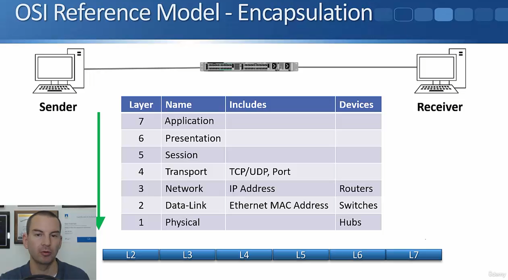
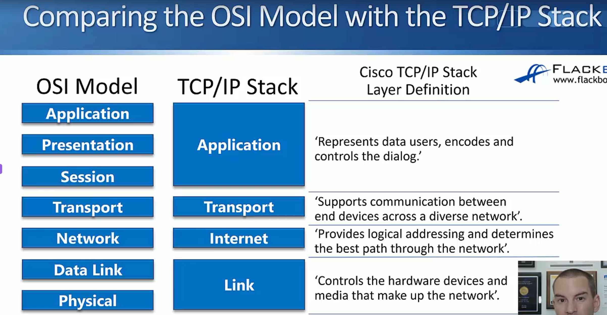
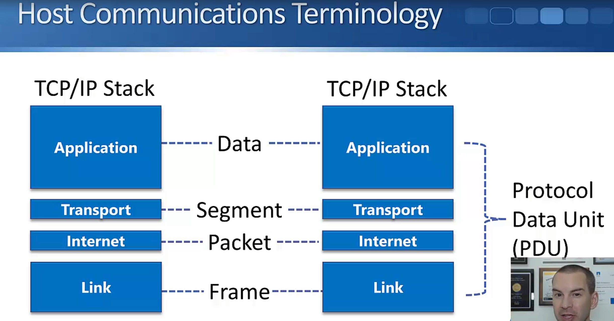

# Network Characteristics 
- topology
- speed
- cost
- security
- availability
- scalability
- Reliability

# OSI Model

Please Do Not Touch Supermans Private Area  OSI Acronym

# TCP/ IP STACK compared to OSI Model

# Host Communications Terminology

# Upper and lower OSI layers

Layer 7 – Application
Where the user actually interacts with the network. This is the layer your apps talk to — protocols like HTTP, FTP, SMTP, DNS live here. It provides network services directly to software (browsers, email clients, etc.).

Layer 6 – Presentation
Formats, translates, encrypts, and compresses data so the application layer can understand it. Handles things like character encoding (ASCII/Unicode), SSL/TLS encryption, and data compression.

Layer 5 – Session
Establishes, manages, and terminates connections ("sessions") between two devices. Keeps track of whose turn it is to send data, handles reconnections, and manages dialogue control.

Layer 4 – Transport
Ensures reliable end-to-end delivery of data. This is where TCP (reliable, ordered, error-checked) and UDP (fast, connectionless) operate. Handles segmentation, flow control, and error recovery.

Layer 3 – Network
Handles logical addressing and routing — deciding the best path for data to travel across different networks. This is where IP addresses and routers operate.

Layer 2 – Data Link
Handles node-to-node data transfer on the same local network segment. Deals with MAC addresses, switches, and error detection/correction at the frame level. Often split into two sublayers: LLC and MAC.

Layer 1 – Physical
The actual physical transmission of raw bits over a medium — cables, radio waves, fiber optics, voltage levels, connectors, hubs. No data meaning here, just electrical/optical/radio signals.