# Network Layer
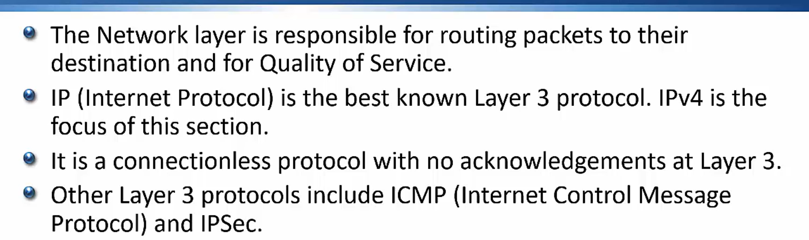

# IP Addressing 
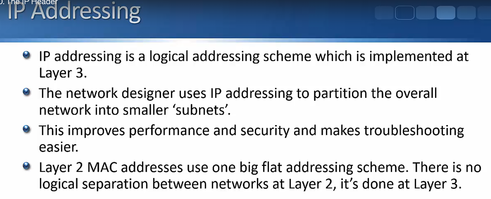

# IP Header
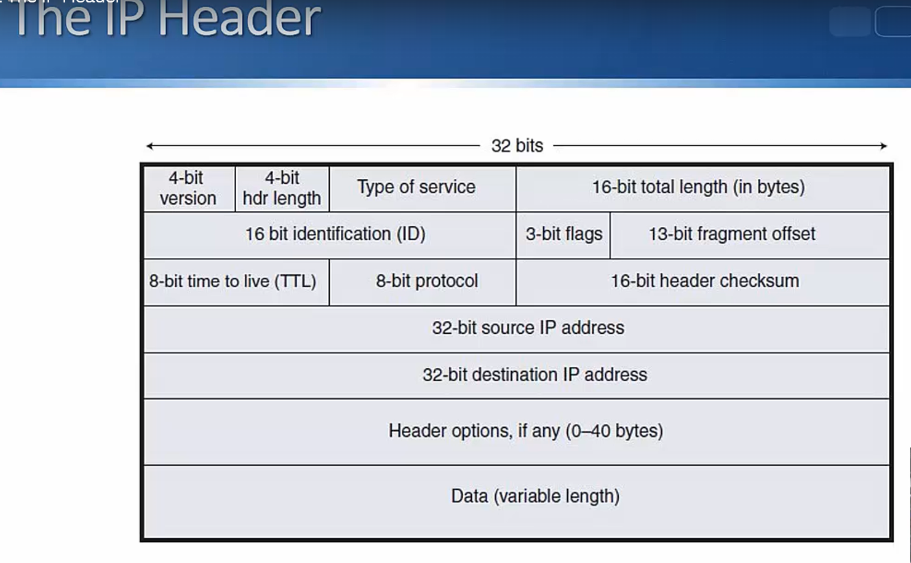

# 3 Main types of IP Traffic
- Unicast
- Broadcast
- Multicast
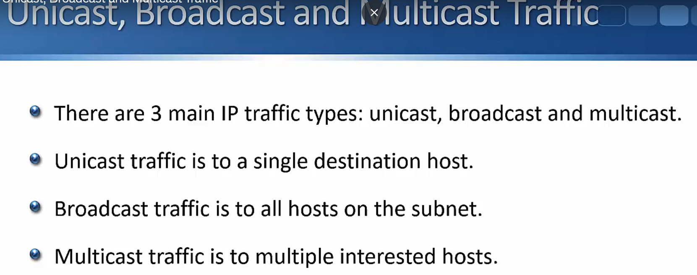

# Counting in Binary
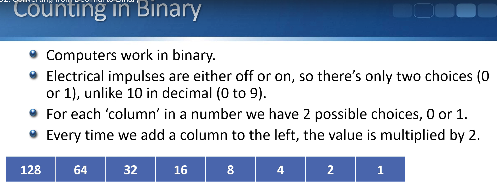

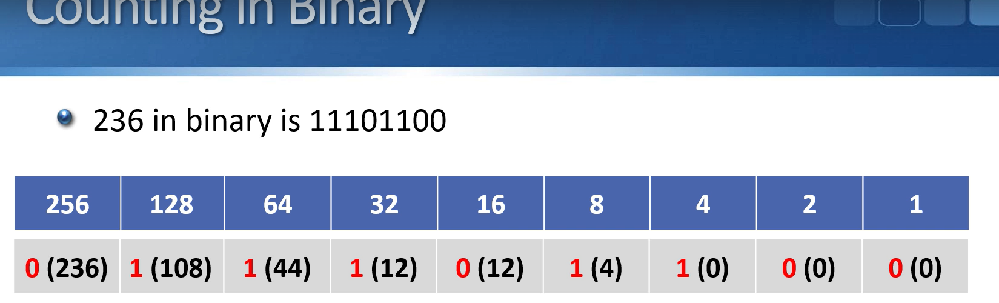

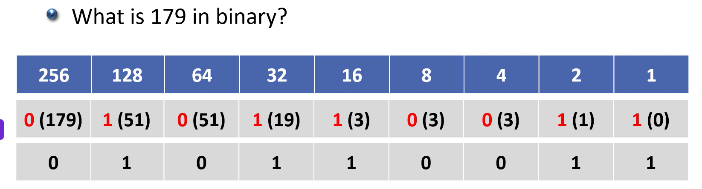

# Static vs Automatic Addressing

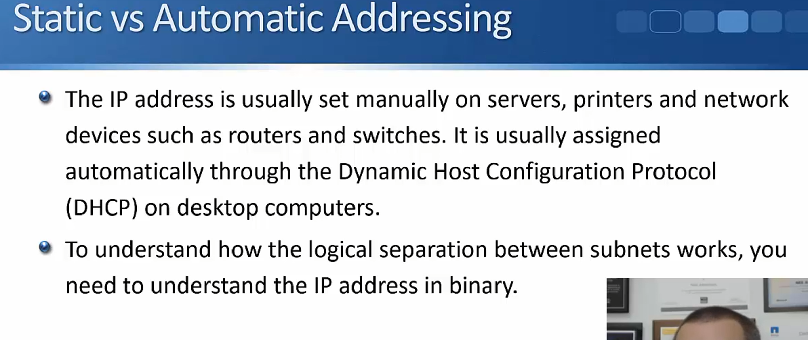

# Converting First Octet to binary

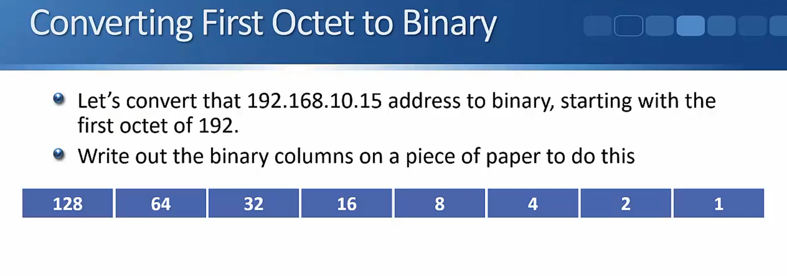

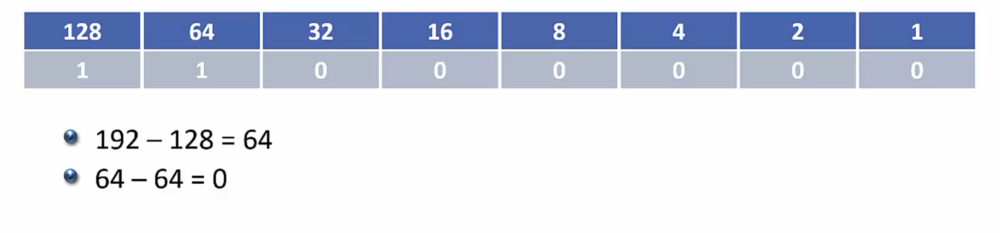

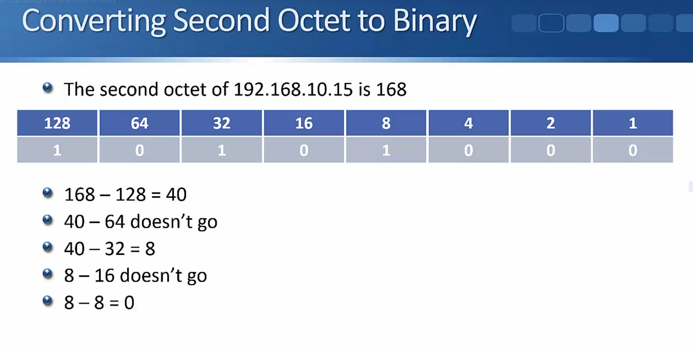

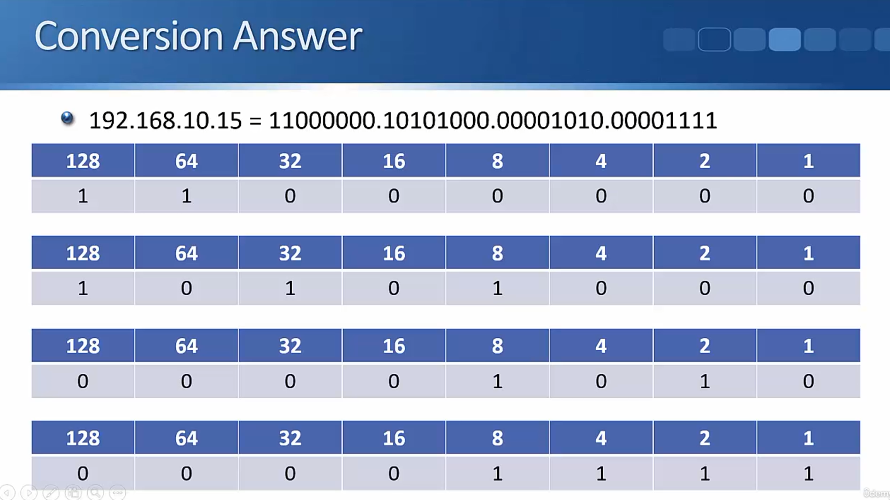

